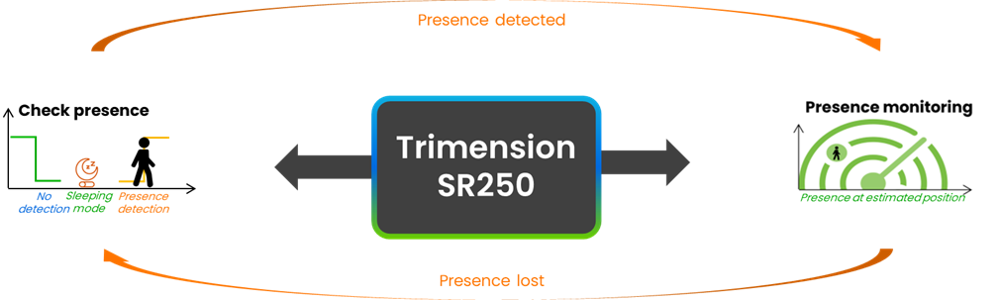
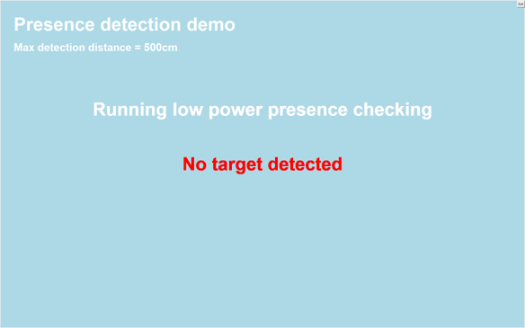
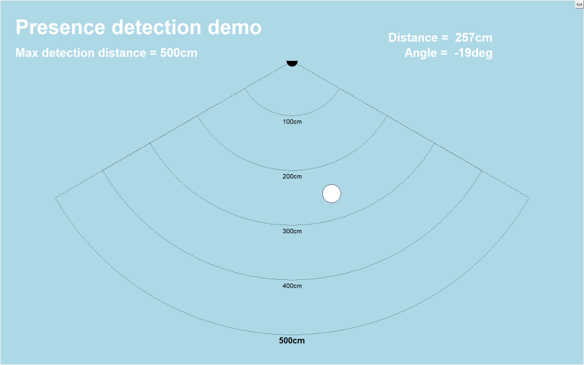

# NXP Application Code Hub
[](https://www.nxp.com)

## UWB Presence Detection demo
Our demonstration showcases a seamless and intelligent sensing experience by uniting ultra‑low‑power presence detection with instant, high‑accuracy positioning.
In its standby state, the system continuously monitors its surroundings with minimal energy usage, remaining ever‑ready to react the moment activity enters the detection zone.
As soon as presence is detected, the application instantly shifts into active tracking mode, precisely identifying and continuously updating the position of the nearest target on a clean, real‑time 2D map.
This smooth transition—from passive monitoring to dynamic spatial awareness—delivers both optimal power efficiency and exceptional responsiveness.
The result is a next‑generation sensing solution perfectly suited for smart environments, automation, security systems, robotics, and any application where knowing not only that something is there, but exactly where it is, makes all the difference.

#### Boards: FRDM-RW612

## Table of Contents
1. [Setup](#step1)
2. [Software](#step2)
3. [Demo details](#step3)
4. [Results](#step4)
5. [Support](#step5)
6. [Release Notes](#step6)

## 1. Setup<a name="step1"></a>
Refer to https://github.com/nxp-appcodehub/an-sr250-uwb-plug-and-play-demo first steps (Software, Hardware and Setup) for the demo environment setup.

## 2. Software<a name="step2"></a>
Install python packages required for the UWB Presence Detection demo by running the following command:
```
pip install -r requirements.txt
```

## 3. Demo details<a name="step3"></a>
The demo is using SR250 **O**n **C**hip **P**resence **D**etection feature. It implements 2 modes:
- “check presence”: sensing for presence in low-power mode
- “presence monitoring”: reporting presence location (only closest one)

The demo switch between those modes according presence is detected or lost



## 4. Results
### 4.1 Running the demo
The demo comes in the form of a python script (*[“demo_presence_detection.py”](demo_presence_detection.py)*) to be run as:
```
 python demo_presence_detection.py <com_port> <max_distance=xxx> <-D>
```
With optional parameters:
- `com_port`: VCOM port of the FRDM-RW612 EVK (default is “COM40”)
- `max_distance`: Maximum detection distance in cm (default is 500 cm)
- `-D`: enable UCI logging

**Note**: For more convenience, a batch file (*[demo_presence_detection.bat](./demo_presence_detection.bat)*) is provided which detect the FRDM-RW612 VCOM port and start the demo with the default parameters.

### 4.2 Demo operation
When started, the demo begins in “check presence” mode.
In this mode, the demo sense for detection of a presence within the “max_distance” range. 
This sensing is done with low RFRI allowing lower power consumption with the trade-off of a bit higher detection latency.



As soon as a presence is detected, the demo switch to “presence monitoring” mode.
In this mode, the demo continuously collects OCPD data outputs, and shows the distance and AoA of the closest target.
The demo computes the related presence location and displays it on a 2Dmap.



When the presence detection is lost, the demo switch back to “check presence” mode.

## 5. Support<a name="step5"></a>
- Reach out to NXP Community page for more support - [NXP Community](https://community.nxp.com/)
- Learn more about SR250 UWB IC for Industrial IoT Ranging and Radar Applications - [Trimension® SR250](https://www.nxp.com/products/SR250)

#### Project Metadata

<!----- Boards ----->
[]()

<!----- Categories ----->
[](https://mcuxpresso.nxp.com/appcodehub?category=sensor)

<!----- Peripherals ----->
[](https://mcuxpresso.nxp.com/appcodehub?peripheral=usb)

<!----- Toolchains ----->
[](https://mcuxpresso.nxp.com/appcodehub?toolchain=vscode)

Questions regarding the content/correctness of this example can be entered as Issues within this GitHub repository.

>**Warning**: For more general technical questions regarding NXP Microcontrollers and the difference in expected functionality, enter your questions on the [NXP Community Forum](https://community.nxp.com/)

[](https://www.youtube.com/NXP_Semiconductors)
[](https://www.linkedin.com/company/nxp-semiconductors)
[](https://www.facebook.com/nxpsemi/)
[](https://x.com/NXP)

## 6. Release Notes<a name="step6"></a>
| Version | Description / Update                           | Date                        |
|:-------:|------------------------------------------------|----------------------------:|
| 1.0     | Initial release on Application Code Hub        | March 30<sup>th</sup> 2026 |
